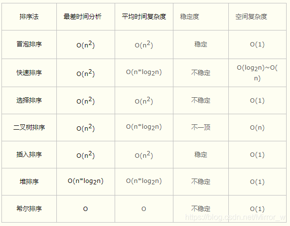
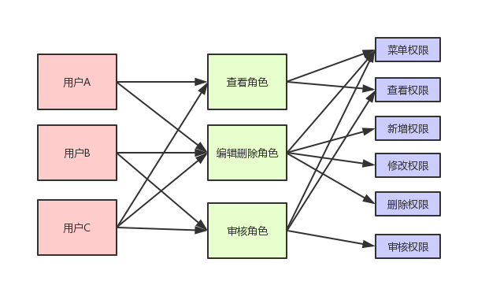
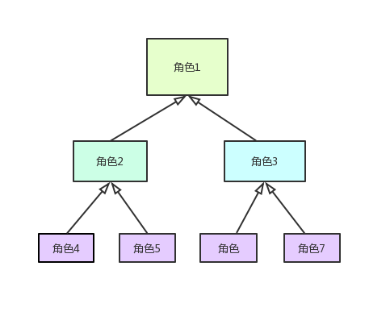

<span id="menu" >
<h1>系统设计</h1>
<!-- TOC -->

- [1. 考察标准](#1-考察标准)
- [2. 系统设计面试思路](#2-系统设计面试思路)
  - [2.1. 常见算法的时间复杂度](#21-常见算法的时间复杂度)
  - [2.2. 准备](#22-准备)
  - [2.3. 性能相关的指标](#23-性能相关的指标)
    - [2.3.1. 性能相关的指标](#231-性能相关的指标)
    - [2.3.2. 常用性能测试工具](#232-常用性能测试工具)
    - [2.3.3. 性能优化](#233-性能优化)
- [3. 系统设计实践](#3-系统设计实践)
  - [3.1. 权限管理系统](#31-权限管理系统)
    - [3.1.1. 权限模型](#311-权限模型)
      - [3.1.1.1. RBAC0模型](#3111-rbac0模型)
      - [3.1.1.2. RBAC1模型](#3112-rbac1模型)
      - [3.1.1.3. RBAC2模型](#3113-rbac2模型)
      - [3.1.1.4. RBAC3模型](#3114-rbac3模型)
  - [3.2. 秒杀系统设计](#32-秒杀系统设计)
    - [3.2.1. 秒杀系统的问题](#321-秒杀系统的问题)
  - [3.3. 设计一个LRU缓存系统](#33-设计一个lru缓存系统)
    - [3.3.1. 算法与数据结构](#331-算法与数据结构)
    - [3.3.2. LRU缓存LinkedHashMap实现](#332-lru缓存linkedhashmap实现)
    - [3.3.3. 自行实现链表＋HashMap](#333-自行实现链表hashmap)
  - [3.4. Feed系统设计](#34-feed系统设计)
  - [3.5. 消息推送系统设计](#35-消息推送系统设计)
  - [3.6. 短URL设计](#36-短url设计)
    - [3.6.1. 设计需求](#361-设计需求)
    - [3.6.2. 算法实现](#362-算法实现)

<!-- /TOC -->

# 1. 考察标准
<a href="#menu">目录</a>

系统设计面试考察点
* 可行性
* 特定问题分析与解决
* 分析能力
* 权衡
* 知识储备

系统设计主要考虑以下三点问题
* 你如何看待问题空间（problem space）？
    * 系统设计目标
        * 功能性
        * 性能
        * 可用性
    * 系统目标用户或者使用场景
    * 系统用户规模
* 你如何看待瓶颈（bottlenecks）？
    * 高并发处理
    * cpu
    * io
    * 内存
    * 网络
* 如何消除这些瓶颈（remove these bottlenecks）

那什么是一个“好的”提问呢？一个好的提问可以帮助你做到以下几点：
* 帮助你缩小设计范围
* 帮助你了解用户对系统的要求
* 给你设计的方向
* 告诉你可能存在的瓶颈（bottlenecks）/问题空间（problem space）


分析方法
* 场景
* 服务
* 存储
* 扩展

**知识准备**
1. 高性能架构设计： 熟悉系统常见性能优化手段比如引入 读写分离、缓存、负载均衡、异步 等等。
2. 高可用架构设计 ：CAP理论和BASE理论、通过集群来提高系统整体稳定性、超时和重试机制、应对接口级故障：降级、熔断、限流、排队。
3. 高扩展架构设计 ：说白了就是懂得如何拆分系统。你按照不同的思路来拆分软件系统，就会得到不同的架构

# 2. 系统设计面试思路
<a href="#menu">目录</a>

## 2.1. 常见算法的时间复杂度

时间复杂度比较:O(1) < O(logn) < O(n) < O(nlogn) < O(n^2) < O(n^3) < O(2^n)



|查找|平均时间复杂度|查找条件|算法描述
|---|---|---|---|
|顺序查找|O(n)|无序或有序队列|按顺序比较每个元素，直到找到关键字为止
|二分查找（折半查找）|O(logn)|有序数组|查找过程从数组的中间元素开始，如果中间元素正好是要查找的元素，则搜素过程结束；如果某一特定元素大于或者小于中间元素，则在数组大于或小于中间元素的那一半中查找，而且跟开始一样从中间元素开始比较。　如果在某一步骤数组为空，则代表找不到。
|二叉排序树查找|O(logn)|二叉排序树|在二叉查找树b中查找x的过程为：1. 若b是空树，则搜索失败2. 若x等于b的根节点的数据域之值，则查找成功；3. 若x小于b的根节点的数据域之值，则搜索左子树4. 查找右子树。
|哈希表法（散列表）|O(1)|先创建哈希表（散列表）|根据键值方式(Key value)进行查找，通过散列函数，定位数据元素。
|分块查找|O(logn)|无序或有序队列|将n个数据元素"按块有序"划分为m块（m ≤ n）。|每一块中的结点不必有序，但块与块之间必须"按块有序"；即第1块中任一元素的关键字都必须小于第2块中任一元素的关键字；而第2块中任一元素又都必须小于第3块中的任一元素，……。然后使用二分查找及顺序查找。


## 2.2. 准备

**问法**
1. 设计一个某某系统比如秒杀系统、微博系统、抢红包系统、短网址系统。
2. 设计某某系统中的一个功能比如哔哩哔哩的点赞功能。
3. 设计一个框架比如 RPC 框架、消息队列、缓存框架、分布式文件系统等等。
4. 某某系统的技术选型比如缓存用Redis 还是 Memcached、网关用 Spring Cloud Gateway 还是 Netflix Zuul2 。

**系统设计怎么做**

**Step1:问清楚系统具体要求**

* 功能性需求和非功能性需求
* 应用场景，单线程／多线程，单体应用／集群，访问量
* 高并发和高可用要求，QPS等参数

**Step2:对系统进行抽象设计**

* 系统架构设计
    * 组件间的关系
    * 安全性设计
    * 如何部署

**Step3:考虑系统目前需要优化的点**


对系统进行抽象设计之后，你需要思考当前抽象的系统设计有哪些需要优化的点，比如说：
* 当前系统部署在一台机器够吗？是否需要部署在多台机器然后进行负载均衡呢？
* 数据库处理速度能否支撑业务需求？是否需要给指定字段加索引？是否需要读写分离？是否需要缓存？
* 数据量是否大到需要分库分表？
* 是否存在安全隐患？
* 系统是否需要分布式文件系统？

## 2.3. 性能相关的指标
<a href="#menu">目录</a>

### 2.3.1. 性能相关的指标

**响应时间RT(Response-time)**:

就是用户发出请求到用户收到系统处理结果所需要的时间。

RT是一个非常重要且直观的指标，RT数值大小直接反应了系统处理用户请求速度的快慢。

**并发数**

并发数可以简单理解为系统能够同时供多少人访问使用也就是说系统同时能处理的请求数量。

并发数反应了系统的负载能力。

**QPS 和 TPS**
* QPS（Query Per Second） ：服务器每秒可以执行的查询次数；
* TPS（Transaction Per Second） ：服务器每秒处理的事务数（这里的一个事务可以理解为客户发出请求到收到服务器的过程）；

QPS vs TPS：QPS 基本类似于 TPS，但是不同的是，对于一个页面的一次访问，形成一个TPS；但一次页面请求，可能产生多次对服务器的请求，服务器对这些请求，就可计入“QPS”之中。如，访问一个页面会请求服务器2次，一次访问，产生一个“T”，产生2个“Q”。

**吞吐量**

吞吐量指的是系统单位时间内系统处理的请求数量。

一个系统的吞吐量与请求对系统的资源消耗等紧密关联。请求对系统资源消耗越多，系统吞吐能力越低，反之则越高。

TPS、QPS都是吞吐量的常用量化指标。

QPS（TPS） = 并发数/平均响应时间(RT)


**系统活跃度**

* PV(Page View): 访问量, 即页面浏览量或点击量，衡量网站用户访问的网页数量；在一定统计周期内用户每打开或刷新一个页面就记录1次，多次打开或刷新同一页面则浏览量累计。UV 从网页打开的数量/刷新的次数的角度来统计的。
* UV(Unique Visitor): 独立访客，统计1天内访问某站点的用户数。1天内相同访客多次访问网站，只计算为1个独立访客。UV 是从用户个体的角度来统计的。
* DAU(Daily Active User):日活跃用户数量。
* MAU(monthly active users): 月活跃用户人数。

举例：某网站 DAU为 1200w， 用户日均使用时长 1 小时，RT为0.5s，求并发量和QPS。

平均并发量 = DAU（1200w）* 日均使用时长（1 小时，3600秒） /一天的秒数（86400）=1200w/24 = 50w

真实并发量（考虑到某些时间段使用人数比较少） = DAU（1200w）* 日均使用时长（1 小时，3600秒） /一天的秒数-访问量比较小的时间段假设为8小时（57600）=1200w/16 = 75w

峰值并发量 = 平均并发量 * 6 = 300w

QPS = 真实并发量/RT = 75W/0.5=100w/s

### 2.3.2. 常用性能测试工具

**Java语言层面**
* JMH做基准测试

**后端**
1. Jmeter ：Apache JMeter 是 JAVA 开发的性能测试工具。
2. LoadRunner：一款商业的性能测试工具。
3. Galtling ：一款基于Scala 开发的高性能服务器性能测试工具。
4. ab ：全称为 Apache Bench 。Apache 旗下的一款测试工具，非常实用

**前端常用**
* Fiddler：抓包工具，它可以修改请求的数据，甚至可以修改服务器返回的数据，功能非常强大，是Web 调试的利器。
* HttpWatch: 可用于录制HTTP请求信息的工具。


### 2.3.3. 性能优化
<a href="#menu">目录</a>

**常见问题**
1. 当前系统的SQL语句是否存在问题？
2. 当前系统是否需要升级硬件？
3. 系统是否需要缓存？
4. 系统架构本身是不是就有问题？
5. 系统是否存在死锁的地方？
6. 数据库索引使用是否合理？
7. 系统是否存在内存泄漏？（Java 的自动回收内存虽然很方便，但是，有时候代码写的不好真的会造成内存泄漏）
8. 系统的耗时操作进行了异步处理？

**常见优化手段**
* SQL优化
* JVM
* DB
* Tomcat参数调优
* 硬件性能优化（内存升级、CPU核心数增加、机械硬盘—>固态硬盘等等）
* 业务逻辑优化/缓存 
* 读写分离、集群等 
* 分库分表


# 3. 系统设计实践
<a href="#menu">目录</a>

## 3.1. 权限管理系统
<a href="#menu">目录</a>

### 3.1.1. 权限模型

#### 3.1.1.1. RBAC0模型

```
用户<--多对多-->角色<--多对多-->权限
```
这是权限最基础也是最核心的模型,它包括用户/角色/权限,其中用户和角色是多对多的关系,角色和权限也是多对多的关系。
* 用户是发起操作的主体,按类型分可分为2B和2C用户,可以是后台管理系统的用户,可以是OA系统的内部员工,也可以是面向C端的用户,比如阿里云的用户。
* 角色起到了桥梁的作用,连接了用户和权限的关系,每个角色可以关联多个权限,同时一个用户关联多个角色,那么这个用户就有了多个角色的多个权限。有人会问了为什么用户不直接关联权限呢?在用户基数小的系统,比如20个人的小系统,管理员可以直接把用户和权限关联,工作量并不大,选择一个用户勾选下需要的权限就完事了。但是在实际企业系统中,用户基数比较大,其中很多人的权限都是一样的,就是个普通访问权限,如果管理员给100人甚至更多授权,工作量巨大。这就引入了"角色(Role)"概念,一个角色可以与多个用户关联,管理员只需要把该角色赋予用户,那么用户就有了该角色下的所有权限,这样设计既提升了效率,也有很大的拓展性。
* 权限是用户可以访问的资源,包括页面权限,操作权限,数据权限:
    * 页面权限: 即用户登录系统可以看到的页面,由菜单来控制,菜单包括一级菜单和二级菜单,只要用户有一级和二级菜单的权限,那么用户就可以访问页面
    * 操作权限: 即页面的功能按钮,包括查看,新增,修改,删除,审核等,用户点击删除按钮时,后台会校验用户角色下的所有权限是否包含该删除权限,如果是,就可以进行下一步操作,反之提示无权限。有的系统要求"可见即可操作",意思是如果页面上能够看到操作按钮,那么用户就可以操作,要实现此需求,这里就需要前端来配合,前端开发把用户的权限信息缓存,在页面判断用户是否包含此权限,如果有,就显示该按钮,如果没有,就隐藏该按钮。某种程度上提升了用户体验,但是在实际场景可自行选择是否需要这样做
    * 数据权限: 数据权限就是用户在同一页面看到的数据是不同的,比如财务部只能看到其部门下的用户数据,采购部只看采购部的数据,在一些大型的公司,全国有很多城市和分公司,比如杭州用户登录系统只能看到杭州的数据,上海用户只能看到上海的数据,解决方案一般是把数据和具体的组织架构关联起来,举个例子,再给用户授权的时候,用户选择某个角色同时绑定组织如财务部或者合肥分公司,那么该用户就有了该角色下财务部或合肥分公司下的的数据权限。




#### 3.1.1.2. RBAC1模型



此模型引入了角色继承(Hierarchical Role)概念,即角色具有上下级的关系,角色间的继承关系可分为一般继承关系和受限继承关系。一般继承关系仅要求角色继承关系是一个绝对偏序关系，允许角色间的多继承。而受限继承关系则进一步要求角色继承关系是一个树结构，实现角色间的单继承。这种设计可以给角色分组和分层，一定程度简化了权限管理工作。

#### 3.1.1.3. RBAC2模型

基于核心模型的基础上，进行了角色的约束控制,RBAC2模型中添加了责任分离关系,其规定了权限被赋予角色时，或角色被赋予用户时，以及当用户在某一时刻激活一个角色时所应遵循的强制性规则。责任分离包括静态责任分离和动态责任分离。主要包括以下约束:

* 互斥角色: 同一用户只能分配到一组互斥角色集合中至多一个角色，支持责任分离的原则。互斥角色是指各自权限互相制约的两个角色。比如财务部有会计和审核员两个角色,他们是互斥角色,那么用户不能同时拥有这两个角色,体现了职责分离原则
* 基数约束: 一个角色被分配的用户数量受限；一个用户可拥有的角色数目受限；同样一个角色对应的访问权限数目也应受限，以控制高级权限在系统中的分配
* 先决条件角色: 即用户想获得某上级角色,必须先获得其下一级的角色

#### 3.1.1.4. RBAC3模型

即最全面的权限管理,它是基于RBAC0,将RBAC1和RBAC2进行了整合


## 3.2. 秒杀系统设计
<a href="#menu">目录</a>

### 3.2.1. 秒杀系统的问题

秒杀系统特点是短时大流量争抢少量的产品。在高并发情况下，会出现较为严重的问题
* 超卖问题
* 少卖问题
* 重复购买问题
* 秒杀接口安全
* 高并发请求对后端存储系统的压力问题


## 3.3. 设计一个LRU缓存系统
<a href="#menu">目录</a>

设计和构建一个“最近最少使用”缓存，该缓存会删除最近最少使用的项目。缓存应该从键映射到值(允许你插入和检索特定键对应的值)，并在初始化时指定最大容量。当缓存被填满时，它应该删除最近最少使用的项目。

它应该支持以下操作： 获取数据 get 和 写入数据 put 。
* 获取数据 get(key) - 如果密钥 (key) 存在于缓存中，则获取密钥的值（总是正数），否则返回 -1。
* 写入数据 put(key, value) - 如果密钥不存在，则写入其数据值。当缓存容量达到上限时，它应该在写入新数据之前删除最近最少使用的数据值，从而为新的数据值留出空间。

### 3.3.1. 算法与数据结构

LRU缓存机制可以通过哈希表加上双向链表实现

双向链表存储键值对，靠近头部的键值是最近使用的，而靠近尾部的键值对是访问时间最久的；哈希表，通过缓存数据的建映射到其在双链表的位置。单独的链表即可实现LRU,但是为了达到O(1)的时间复杂度，需要借助HashMap;如果需要在多线程环境下使用，还需要借助synchronized来实现互斥访问。

### 3.3.2. LRU缓存LinkedHashMap实现

使用LRU缓存LinkedHashMap实现时，只需要实现方法removeEldestEntry即可，返回true时会删除末尾元素。
```java
//LinkedHashMap的一个构造函数，当参数accessOrder为true时，即会按照访问顺序排序，最近访问的放在最前，最早访问的放在后面
public LinkedHashMap(int initialCapacity, float loadFactor, boolean accessOrder) {
    super(initialCapacity, loadFactor,accessOrder);
}

//LinkedHashMap自带的判断是否删除最老的元素方法，默认返回false，即不删除老数据
//我们要做的就是重写这个方法，当满足一定条件时删除老数据
protected boolean removeEldestEntry(Map.Entry<K,V> eldest) {
    return false;
}
```

**实现原理**

每次只要访问该key，都会调用afterNodeAccess方法，该方法会将访问的数据移动到队列的tail.
```java

void afterNodeAccess(Node<K,V> e) { // move node to last
    LinkedHashMap.Entry<K,V> last;
    if (accessOrder && (last = tail) != e) {

        LinkedHashMap.Entry<K,V> p = (LinkedHashMap.Entry<K,V>)e;
        LinkedHashMap.Entry<K,V> b = p.before;
        LinkedHashMap.Entry<K,V> a = p.after;
        
        p.after = null;
        if (b == null)
            head = a;
        else
            b.after = a;
        if (a != null)
            a.before = b;
        else
            last = b;
        if (last == null)
            head = p;
        else {
            p.before = last;
            last.after = p;
        }
        tail = p;
        ++modCount;
    }
}
```
当插入或者更新元素时，会调用该方法，用于移除head元素(如果removeEldestEntry()返回true的话)
```java
void afterNodeInsertion(boolean evict) { // possibly remove eldest
    LinkedHashMap.Entry<K,V> first;
    if (evict && (first = head) != null && removeEldestEntry(first)) {
        K key = first.key;
        removeNode(hash(key), key, null, false, true);
    }
}
```

注意，由于其使用的是HashMap实现，在多线程环境下使用会存在问题，如果在多线程环境下使用，可以使用synchronized进行同步。


### 3.3.3. 自行实现链表＋HashMap

```java

public class LRUCache1<K, V> {

    private final int MAX_CACHE_SIZE;
    private Entry first;
    private Entry last;

    private HashMap<K, Entry<K, V>> hashMap;

    public LRUCache1(int cacheSize) {
        MAX_CACHE_SIZE = cacheSize;
        hashMap = new HashMap<K, Entry<K, V>>();
    }

    public void put(K key, V value) {
        Entry entry = getEntry(key);
        if (entry == null) {
            if (hashMap.size() >= MAX_CACHE_SIZE) {
                hashMap.remove(last.key);
                removeLast();
            }
            entry = new Entry();
            entry.key = key;
        }
        entry.value = value;
        moveToFirst(entry);
        hashMap.put(key, entry);
    }

    public V get(K key) {
        Entry<K, V> entry = getEntry(key);
        if (entry == null) return null;
        moveToFirst(entry);
        return entry.value;
    }

    public void remove(K key) {
        Entry entry = getEntry(key);
        if (entry != null) {
            if (entry.pre != null) entry.pre.next = entry.next;
            if (entry.next != null) entry.next.pre = entry.pre;
            if (entry == first) first = entry.next;
            if (entry == last) last = entry.pre;
        }
        hashMap.remove(key);
    }

    private void moveToFirst(Entry entry) {
        if (entry == first) return;
        if (entry.pre != null) entry.pre.next = entry.next;
        if (entry.next != null) entry.next.pre = entry.pre;
        if (entry == last) last = last.pre;

        if (first == null || last == null) {
            first = last = entry;
            return;
        }

        entry.next = first;
        first.pre = entry;
        first = entry;
        entry.pre = null;
    }

    private void removeLast() {
        if (last != null) {
            last = last.pre;
            if (last == null) first = null;
            else last.next = null;
        }
    }


    private Entry<K, V> getEntry(K key) {
        return hashMap.get(key);
    }

    @Override
    public String toString() {
        StringBuilder sb = new StringBuilder();
        Entry entry = first;
        while (entry != null) {
            sb.append(String.format("%s:%s ", entry.key, entry.value));
            entry = entry.next;
        }
        return sb.toString();
    }

    class Entry<K, V> {
        public Entry pre;
        public Entry next;
        public K key;
        public V value;
    }
}
```

## 3.4. Feed系统设计
<a href="#menu">目录</a>

Feed流本质上是一个数据流，是将 “N个发布者的信息单元” 通过 “关注关系” 传送给 “M个接收者”。

Feed流系统是一个数据流系统，所以我们核心要看数据。从数据层面看，数据分为三类，分别是：
* 发布者的数据：发布者产生数据，然后数据需要按照发布者组织，需要根据发布者查到所有数据，比如微博的个人页面、朋友圈的个人相册等。
* 关注关系：系统中个体间的关系，微博中是关注，是单向流，朋友圈是好友，是双向流。不管是单向还是双向，当发布者发布一条信息时，该条信息的流动永远是单向的。
* 收者的数据：从不同发布者那里获取到的数据，然后通过某种顺序（一般为时间）组织在一起，比如微博的首页、朋友圈首页等。这些数据具有时间热度属性，越新的数据越有价值，越新的数据就要排在最前面。

针对这三类数据，我们可以有如下定义：

* 存储库：存储发布者的数据，永久保存。
* 关注表：用户关系表，永久保存。
* 同步库：存储接收者的时间热度数据，只需要保留最近一段时间的数据即可。

 

设计Feed流系统时最核心的是确定清楚产品层面的定义，需要考虑的因素包括：
* 产品用户规模：用户规模在十万、千万、十亿级时，设计难度和侧重点会不同。
* 关注关系（单向、双写）：如果是双向，那么就不会有大V，否则会有大V存在。

上述是选择数据存储系统最核心的几个考虑点，除此之外，还有一些需要考虑的：
* 如何实现Meta和Feed内容搜索？
虽然Feed流系统本身可以不需要搜索，但是一个Feed流产品必须要有搜索，否则信息发现难度会加大，用户留存率会大幅下降。

* Feed流的顺序是时间还是其他分数，比如个人的喜好程度？

双向关系时由于关系很紧密，一定是按时间排序，就算一个关系很紧密的人发了一条空消息或者低价值消息，那我们也会需要关注了解的。

单向关系时，那么可能就会存在大V，大V的粉丝数量理论极限就是整个系统的用户数，有一些产品会让所有用户都默认关注产品负责人，这种产品中，该负责人就是最大的大V，粉丝数就是用户规模。


## 3.5. 消息推送系统设计
<a href="#menu">目录</a>

## 3.6. 短URL设计
<a href="#menu">目录</a>

场景:某个链接的长度较长，当将它分享给其他人的时候，希望转换成短的URL,访问该URL就能访问到原始URL的内容。还需要考虑的需求是时间有效性，是长期有效还是固定时间内有效。

以网址：https://www.zhihu.com/question/29270034 为例。

### 3.6.1. 设计需求

短网址应为单独的服务，假设该服务的域名为https://su.cn ，当将上面的长URL发送给短网址服务进行转换，服务返回转换后的短网址，https://su.cn／1vmcmu　。用户就可以将该短网址分享出去，当访问该短网址的时候，访问的是短网址服务。该服务再进行301重定向到原始网址。

扩展功能:删除记录，有效期，权限

还需要考虑的问题是高并发访问，转换的效率，高可用性。


### 3.6.2. 算法实现

使用自增序列算法，可以保证长网址唯一对应一个短网址。这里存储的方案可以选择mysql或者redis。从性能上考虑，最好选择redis.

第二种方式是使用md5算法，但是这种会存在重复的可能性，也就是一个短网址对应多个长网址。
1. 将长网址 md5 生成 32 位签名串,分为 4 段, 每段 8 个字节
2. 对这四段循环处理, 取 8 个字节, 将他看成 16 进制串与 0x3fffffff(30位1) 与操作, 即超过 30 位的忽略处理
3. 这 30 位分成 6 段, 每 5 位的数字作为字母表的索引取得特定字符, 依次进行获得 6 位字符串
4. 总的 md5 串可以获得 4 个 6 位串,取里面的任意一个就可作为这个长 url 的短 url 地址

第一种算法的好处就是简单好理解，永不重复。但是短码的长度不固定，随着 id 变大从一位长度开始递增。如果非要让短码长度固定也可以就是让 id 从指定的数字开始递增就可以了。百度短网址用的这种算法。

第二种算法，存在碰撞（重复）的可能性，虽然几率很小。短码位数是比较固定的。不会从一位长度递增到多位的。据说微博使用的这种算法。


**设计思路：**

|id|long_url|short_url|
|---|---|---|
|1|https://hufangyun.com/2017/short-url/|sacd21|
|2|https://dwz.cn/console/apidoc/v3|fgfgc|

当有一个新的长网址时，查询数据库中是否存在记录,不存在则插入，获取到该记录的主键，再将主键进行进制转换层短网址，最后将短网址插入数据库字段short_url。

当通过短网址查询长网址时，直接查询数据库即可。

如果使用redis，思路基本一致，但需要一个额外的字段存储序列号的最大值。每次添加新的长网址，使用最大值序列号自增即可。长网址和短网址的存储类型可以选择哈希结构。

进制转换：

这里选择的是[0-9a-zA-Z],一共62个字符，也就是62进制。从下面可以看出进制越大，转换出来的字符串长度越小。

```yml
[100000000]转换成[10]进制为[100000000]
[100000000]转换成[15]进制为[8ba496a]
[100000000]转换成[20]进制为[1b50000]
[100000000]转换成[25]进制为[a60000]
[100000000]转换成[30]进制为[43dl3a]
[100000000]转换成[35]进制为[1vmcmu]
[100000000]转换成[40]进制为[D2k00]
[100000000]转换成[45]进制为[ohhwa]
[100000000]转换成[50]进制为[g0000]
[100000000]转换成[55]进制为[aP2KJ]
[100000000]转换成[60]进制为[7GVKE]
```

[进制转换工具](https://tool.lu/hexconvert/)

进制转换实现
```java
public static String numberToString(long tenRadix, int radix)
{
    // 进制编码支持10+26+26=62进制
    String code = "0123456789abcdefghijklmnopqrstuvwxyzABCDEFGHIJKLMNOPQRSTUVWXYZ";
    StringBuilder buf = new StringBuilder();
    int remainder = 0;
    while (tenRadix != 0)
    {
        remainder = (int)(tenRadix % radix);// 求余数
        tenRadix = tenRadix / radix;// 除以基数
        buf.append(code.charAt(remainder));// 保存余数，记得要倒叙排列
    }
    buf.reverse();// 倒叙排列
    return buf.toString();
}
public static int stringToNumber(String otherRadixStr, int radix)
{
    StringBuilder stringBuilder = new StringBuilder(otherRadixStr);
    stringBuilder.reverse();// 反转字符，为了把权重最大的放在最右边，便于下面从左到右遍历，根据下标求权重。
    // 如果不反转，从右向左遍历(从字符串下标大的一端)也可以
    char bitCh;
    int result = 0;
    for (int i = 0; i < stringBuilder.length(); i++)
    {
        bitCh = stringBuilder.charAt(i);
        if (bitCh >= '0' && bitCh <= '9')
        {
            // '0'对应的ASCII码整数：48
            result += (int) (bitCh - '0') * pow(radix, i);
        } else if (bitCh >= 'A' && bitCh <= 'Z')
        {
            // 减去'A'的ASCII码值(65),再加上10
            result += ((int) (bitCh - 'A') + 10) * pow(radix, i);
        } else if (bitCh >= 'a' && bitCh <= 'z')
        {
            // 减去'a'的ASCII码值(97),再加上10
            result += ((int) (bitCh - 'a') + 10) * pow(radix, i);
        }
    }
    return result;
}    
```


还需要注意的是，由于是并发环境，同时为了高可用还会部署多个服务，所以相关代码需要使用分布式锁防止并发问题。redis还可以结合lua来实现。


